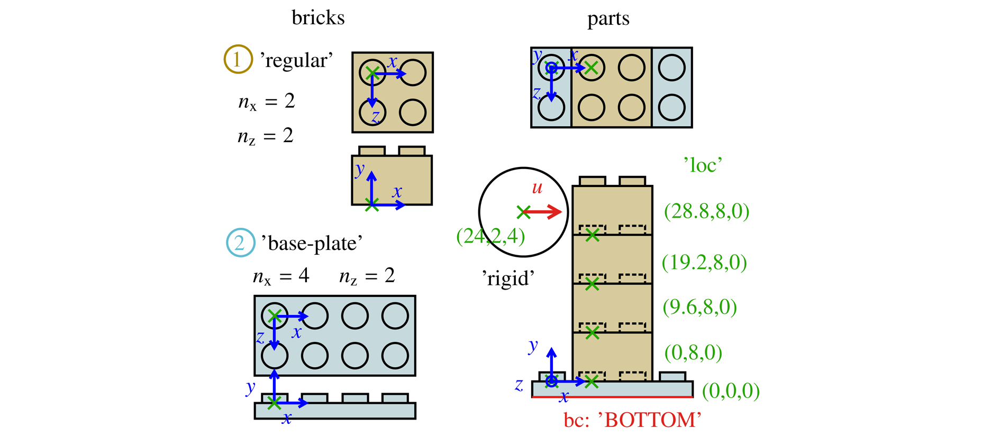
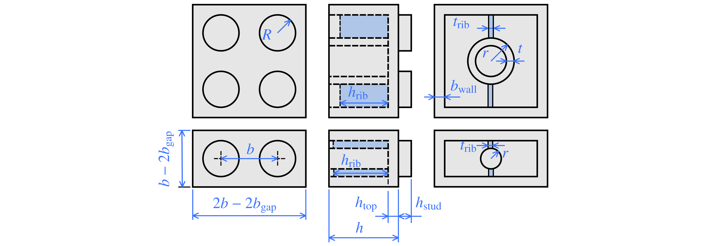
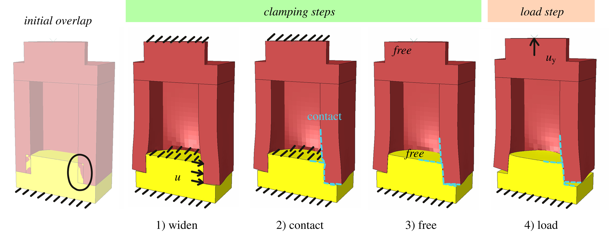
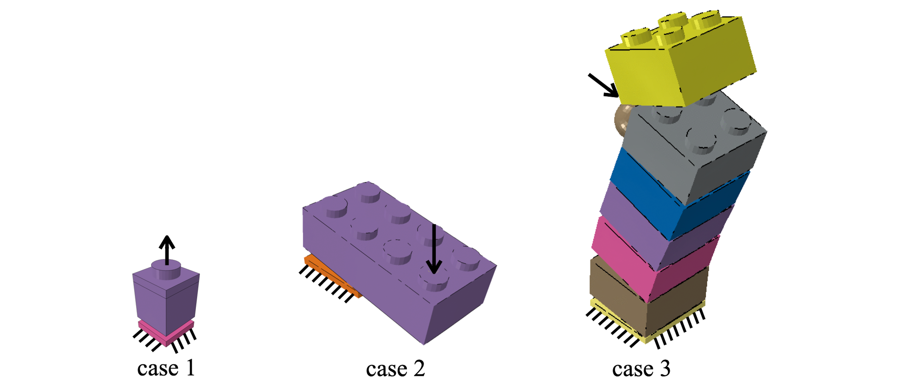

# BrickFEM: Automated Abaqus/Python model for simple Lego sets

BrickFEM automatically generates, runs, and evaluates models of small Lego sets in the finite element software Abaqus. The model can contain Lego bricks, plates, tiles, and base plates. The model first establishes the clamping of the bricks and then loads them using either a static (implicit) or dynamic (explicit) step.

 
<p align="center">
Figure 1: Some $1\times4$ and $2\times4$ Lego bricks with their studs and cavities.
</p>

### Dependencies
* [Simulia Abaqus](https://www.3ds.com/products-services/simulia/products/abaqus) 2017 or later
* [imagmagick](https://imagemagick.org) (optional, to create animated gifs of the results)

### Quick start

The files `brickfem.py` and `model_case_1.py` must be in your working directory. Then you can run BrickFEM with the command `abaqus cae nogui=model_case_1.py` in a command window or shell (if your Abaqus installation is set up so that you can open an Abaqus CAE window with `abaqus cae`). This runs the first test case of BrickFEM. You can customize the `assembly` and `explicit_par` dictionaries in the Python file `model_case_1.py` to create your first own BrickFEM Lego model.

The syntax in the input dictionaries and the details of the model are described in the following.

## 1. Using BrickFEM

This section first defines the format of the input dictionaries for BrickFEM that define the brick arrangement (`assembly`), the loads of a dynamic, explicit step (`explicit_par`), and the basic Lego dimensions (`lego_geom`), see Figure 2. It then explains how to run BrickFEM using the input dictionaries.

Instead of running a dynamic, explicit load for Lego sets that disassemble, the load can also be applied in a static, implicit step. The static analysis does not converge any more once the bricks disassemble. Therefore, the implicit load is only relevant for Lego sets that slightly deform and do not disassemble.


<p align="center">
Figure 2: Structure of the model function <code>make_model</code> that creates, runs, and evaluates the Lego model from the input dictionaries <code>assembly</code>, <code>explicit_par</code>, and <code>lego_geom</code>. Note that <code>lego_geom</code> is optional. By default, it contains  basic Lego dimensions and the Lego material properties.
</p>

### 1.1 Definition of brick assembly and loads

The assembly of a Lego set in BrickFEM is defined in the dictionary `assembly`. The subdictionary `bricks` lists the bricks used in the model. The subdictionary `parts` places these bricks, referenced by their `brick_id`, at the locations `loc`, see Figure 3. Optionally, the color of each part for the output video can be defined as `c`, specifying either one of the solid Lego brick colors from [Bricklink](https://www.bricklink.com/catalogColors.asp) or a 6-digit hex code as a string. Note that any brick defined in the `bricks` subdictionary can be used multiple times in the model by referring to it multiple times in the `parts` subdictionary. The assembly dictionary also defines the boundary conditions `bc`, the loads on the brick sets `loads_rp`, the mesh size `mesh_size`, and the friction coefficient `mu`:

```python
assembly = {
 'name':'case1-pull-1x1',
 'bricks':{1:{'type':'base-plate', 'nx':1, 'nz':1},
           2:{'type':'regular', 'nx':1, 'nz':1}},
 'parts':{1:{'brick_id':1,'loc':(0,0,0),'c':'Yellow'},
          2:{'brick_id':2,'loc':(0,0,0)},'c':'Red'},
 'bc':{1:{'part_id':1, 'set_name':'BOTTOM'}},
 'loads_rp':{1:{'part_id':2, 'set_name':'STUD-11', 'uy':2}},
 'mesh_size':0.75, 'mu':0.2}
```

The assembly dictionary is sufficient to define the Lego set, including all loads for the static, implicit analysis. For a dynamic, explicit analysis, additional parameters must be defined and loads by rigid bodies can be applied, see the next section.

The bricks in the `assembly` are defined by their brick type `type`, which can be `regular`, `plate`, `tile`, or `base-plate`. The size of the brick is defined by the number of studs in the x-direction and in the z-direction by the parameters `nx` and `nz`, respectively. So a $2\times4$ brick with the longer axis in x-direction has $n_\mathrm{x}=4$ and $n_\mathrm{z}=2$. Note that no rotation of bricks is implemented in the model so that a $2\times4$ brick must be defined twice if its longer axis points into the x direction for some bricks and the z direction for others.

 
<p align="center">
Figure 3: Definition of the bricks used in the model (a $2\times2$ brick and a $2\times4$ base-plate) and the positioning of them in the assembly. The green coordinates state the locations of the instances <code>loc</code> of the bricks. The load in the model is applied using a rigid cylinder with a displacement <code>u</code>  in x-direction (which can be defined in the <code>explicit_par</code> dictionary).
</p>

Figure 4 shows the shape and coordinate system origin (green x) of the four possible brick types `regular`, `plate`, `tile`, and `base-plate`. The height without stud $h$ for the plate and tile is only one third of a `regular` brick. The y-origin of the bricks lies in the bottom plane for all brick types except for the `base-plate`, where it lies at the bottom of the stud. The x- and z-coordinates of the origin of the brick lie in the center of the upper left stud. When referring to studs of a brick, this is done in terms of their indices $i_x$, $i_z$, with $i_x$ and $i_z$ starting at 1.


<p align="center">
Figure 4: Brick options in the model with their corresponding geometry and the origin of the coordinate system (marked as a green <code>x</code>). Note that the upper left midpoint of the stud is defined as the origin. The position where bricks with type <code>'regular'</code> or <code>'plate'</code> are divided into two parts and then connected using tie-constraints is also shown.
</p>


The boundary conditions are defined in the `bc` subdictionary of `assembly`. It needs the part id and the name of the set to be fixed. Possible sets are `'BOTTOM'`, `'TOP-FACES'`, and `'STUD-ij'` for the bottom face, all top faces, or the top face of the stud with index $i=i_x$ and $j=i_z$, respectively.

Loads that should be applied to sets via reference points work like boundary conditions: The part number and the `set_name` must be specified. Then a reference point is automatically created in the center of the set, and all nodes of the set are rigidly coupled to this reference point. The displacements and rotation angles of the RP can be specified with the parameters `ux`, `uy`, `uz`, `rotx`, `roty`, or `rotz`. If one or more of these displacements are not specified, the displacement is free in the model.

The `mesh_size` defines the global mesh size in the Lego bricks. Linear hexahedral elements with reduced integration are used for implicit load steps and linear tetrahedral elements for explicit load steps. For hexahedral elements, the `regular` bricks and `plates` are split into two parts at $y=h-h_\mathrm{top}$ and then connected using surface-based [tie-constraints](http://130.149.89.49:2080/v2016/books/usb/default.htm?startat=pt08ch35s03aus134.html) from Abaqus, see Figure 4.

BrickFEM models the contact using the penalty contact algorithm of Abaqus with the friction coefficient `mu`. For the implicit steps (including the clamping steps), the Surface to Surface contact option of Abaqus is used and for the explicit loading step, BrickFEM uses General Contact.


### 1.2 Definition of explicit load parameters

Parameters of the explicit load step and loads by rigid bodies are defined in the `explicit_par` dictionary. If  `make_model` is parsed an empty dictionary for `explicit_par`, the model will be run implicitly using only the parameters from the `assembly` dictionary. By default, `explicit_par` is an empty dictionary.

The `explicit_par` dictionary may look like this:

```python
explicit_par = {
 't_step': 0.0005, 'is_acc': 0, 'mass_scale_t': 0,
 'load_str': '',
 'loads_rigid': {1:{'shape':'sphere','u':(20,0,0),
                    'radius':4.,'loc':(-8.1,9.6*4.5,4)}}}
```

The `explicit_par` dictionary contains the following parameters:

* `t_step`: The time of the explicit step (float) or the times of the explicit steps (list), which are computed independently.
* `is_acc`: Whether the load should be applied with constant acceleration (1) or constant velocity (0) to reach the total displacement at the end of the step.
* `mass_scale_t`: If 0, no mass scaling will be used. If not 0, this is the target time step to use for mass scaling.
* `load_str`: String to add to the model name. If the same Lego set is loaded in different ways defined in separate `explicit_par` dictionaries, it may be convenient to identify these load cases in the model name.

The subdictionary `loads_rigid` defines rigid parts for loading, which can be either spheres (`sphere`) or cylinders (`cyl`). Both need a location of their center and a radius, which are specified as `loc` and `radius` in the dictionary. The cylinder also needs the `direction` of the cylinder axis and its length `len`. Note that the reference point of the cylinder lies at half of its length for the cylinder and at the center of the sphere, and the location indicates where this center should be located.

The displacement of the rigid part is given in `u` as a list ( $u_x$, $u_y$, $u_z$). The rotations of the rigid part are always fixed. Alternatively, the rigid part can have an initial velocity and move freely in the load step. This can be realized by specifying `m` and `v0` in `loads_rigid` to indicate the mass and the initial velocity of the rigid part, respectively. The moments of inertia $I_\mathrm{jj}$ are calculated from the mass $m$ and the radius $r$ as $I_\mathrm{xx}=I_\mathrm{yy}=I_\mathrm{zz}=2/5 m r^2$ for the sphere. For the cylinder with a length $l$, the moments of inertia are set to $I_\mathrm{xx}=1/2 m r^2$ and $I_\mathrm{yy}=I_\mathrm{zz}=1/12 l m^2$ with the x-axis as the cylinder axis.

To calculate multiple explicit load cases with different rigid body loads, it is not necessary to run the initial clamping steps each time. The parameter `is_new` (default value 1) can be set to zero as soon as the result files of the clamping steps are available:

```
make_model(assembly,explicit_par,is_new=0)
```

Note that this is only relevant for explicit loads because for implicit loads, there are no separate result files for the clamping and the loading steps.


### 1.3 Definition of the general brick dimensions
BrickFEM uses the geometry of the 1961 Lego [patent](https://patents.google.com/patent/US3005282A/en), see Figure 5. It further introduces the additional ribs between the inner tubes at every second inner tube or cylinder, see Figure 1.

The `lego_geom` dictionary, which is an optional input to the `make_model` function, contains all the general geometry parameters as well as the elastic properties of the brick material. If not passed to the `make_model` function, this dictionary will be used instead:

```python
lego_geom = {
 'b, b_gap, b_wall': (8., 0.1, 1.6),
 'h, h_stud, h_top': (9.6, 1.7, 1.5),
 'inside small': {'r': 1.6, 't_rib':1.1, 'h_rib':8.1},
 'inside big': {'r': 3.3, 't': 0.9, 't_rib':0.9, 'h_rib': 6.8},
 'delta_r': 0.05,
 'E, nu, dens': (2200., 0.35, 1e-9)}
```

Figure 5, which shows a $2 \times 2$ and a $1\times2$ brick, defines the corresponding geometric parameters of `lego_geom`. For bricks with a size of at least $2 \times 2$, the bottom cavities contain tubes with an outer radius $r$ and a thickness $t$, defined in the subdictionary `inside big`. For bricks with of size $1 \times n$ or $n \times 1$ with $n > 1$, the bottom cavity contains cylinders with a radius $r$ that are defined in `inside small`.  


<p align="center">
Figure 5: General dimensions parameters of Lego bricks in BrickFEM, shown for a $2\times2$ brick and a $2\times1$ regular brick. Note that these bricks would not have the ribs shown as blue faces. However, they are drawn to indicate their height and thickness.</p>

For $n_x \times n_z$ `regular` bricks with either $n_x \geq 4$ or $n_z \geq 4$, there may be inner ribs connecting the lower cylinders or tubes. These ribs are only on every second cylinder or tube. Only regular bricks with an even number of studs have these ribs perpendicular to the direction of their even number. For $n_x=1$ or $n_z = 1$, the ribs have a thickness and an inner height which are defined in the `inside cyl` dictionary as `t_rib` and `h_rib`, respectively. If $min(n_x,n_z) \geq 2$, the rib thickness and height are specified in the same way in the `inside big` dictionary. See Figure 5 for the rib geometry. To not use these sidewalls, simply set `t_rib` to 0.

The stud radius follows from the space in the cavities plus the radius difference $\Delta r$, the oversize of the studs:

$$R = b/2-b_\mathrm{gap}-b_\mathrm{wall}+\Delta r$$

The elastic properties $E$ and $\nu$ as well as the density $\rho$ of the Lego bricks are given in the `lego_geom` dictionary and are assumed to be the same for all parts of the model.

-----------------------

#### 1.4 Running the model

BrickFEM uses the dictionaries `assembly`, `explicit_par`, and, optionally, `lego_geom` defined in the previous sections to build, run, and evaluate the model. It further has the boolean parameter `is_new` (default value of 1) as an input, which states if the initial computation for establishing contact should be performed (1) or if it already exists (0).

BrickFEM can be run in a new Abaqus Python script that loads the function `make_model` from the Python script `brickfem.py`:

```python
from brickfem import make_model

# define assembly and explicit_par
# ...

make_model(assembly,explicit_par,is_new)
```

Such Python files for the three test cases (such as `model_case_1.py`) are provided with the software. If different general brick dimensions or brick material should be used, the `lego_geom` default value can be changed in the `brickfem.py` file or can be passed to the `make_model` function.

Abaqus lets the user run Python scripts either interactively (in an open Abaqus CAE window or by executing the command `abaqus cae script=script.py` in the command window) or in the background executing the command `abaqus cae nogui=script.py` in the command window. Calling abaqus like this from the command window works, provided the Abaqus path has been added to the system variables.
It is recommended to run the Python script that calls the `make_model` function with the second (`nogui`) option, because the command in the Abaqus Python files that waits for jobs to be finished before evaluation usually crashes when the script is run interactively. This is a bug of Abaqus.

On Windows machines, one or more than one such commands can be written into a batch file that then runs the Lego models. Such a file is also provided for the case 1 model (`_run_nogui_case_1.bat`).

-----------------------

### 1.5 Output of the model

Calling the function `make_model` creates, executes, and evaluates the Abaqus model. in a subfolder defined in `assembly['name']`. The parameters of the model are written to the following files:

* '_dict-assembly.json': Parameters of `lego_geom` and the `assembly`
* model_name + '-par.json': Parameters of the `explicit_par`

Since the assembly and the basic geometry must be the same in each folder, they are written into one file. The `explicit_par` dictionary can change for different explicit loads, so it is written along with each model file. 

The complete output is written by Abaqus to the `.odb` file. Some output is automatically extracted from the odb file: History output of the whole model (energies) and the reference points (displacements and reaction forces) and an animated gif (if `imagemagick` is available) containing a video of the deforming Lego set in the load step. This output is written to the following files:

* model_name + '-ho-ass.dat': History output of the assembly (energies)
* model_name + '-ho-node{i}.dat': History output of reference point `i`
* model_name + '-anim.gif': Animated gif of the moving and deforming Lego set


## 2. Obtaining the clamping connection between the bricks

This section explains how the clamping between the bricks is established in three implicit steps that precede the load application step. Note that BrickFEM automatically generates these clamping steps using the arrangement of the Lego bricks specified by the user in the `assembly` dictionary.

The main challenge in modeling a Lego set is to establish the clamping of the bricks in an accurate and efficient way. In a finite element model, the contact faces cannot initially overlap. Therefore, the model cannot start with the bricks in their positions in the set, but has to stick them together in some way.

This could be done by simulating how all the bricks are stuck together, one brick at a time. The computation time for this would be enormous. BrickFEM uses a trick to realize the clamping of all bricks at the same time, thus saving computation time. This is done in three static, implicit _clamping steps_, see Figure 6:

* `widen`: The initial overlap of surfaces is removed by moving nodes of the lower cavities. This means that nodes at the surface that would lie inside the stud of another brick are moved so that there is no overlap. The top faces of the studs are fixed in this step to prevent relative movement between the bricks,
* `contact`: In the second step, the contact between the studs and the lower cavities of the bricks starts and the applied displacements of the `widen` step are freed. This creates a first clamp between the bricks. However, since the top faces of the studs are still fixed, however, this clamping is unrealistic.
* `free`: The `free` step frees the top faces of the studs, creating a realistic clamp connection between the bricks is obtained. This is the starting point for applying the loads in another step.

The `load` step can be either a static ([implicit](http://130.149.89.49:2080/v2016/books/usb/default.htm?startat=pt03ch06s02at01.html)) or dynamic ([explicit](http://130.149.89.49:2080/v2016/books/usb/default.htm?startat=pt03ch06s03at08.html)) step. For the explicit step, the results of the implicit clamping steps are automatically loaded into the explicit model by BrickFEM. For an implicit load step, the `load` step can be created in the same model as the clamping steps.



<p align="center">
Figure 6: Steps in the Lego model: The initial penetration of the contact surfaces is resolved in the <code>widen</code> step. Then, contact is defined between the bricks while fixing the top surfaces of the studs. In the next step, the fixed faces are released, and equilibrium is found. Then, the clamped Lego bricks can be loaded in the <code>load</code> step, which can be either static (implicit) or dynamic (explicit).
</p>

## 3. Three illustrative examples

To illustrate  the usage of BrickFEM, three simple examples of Lego sets are defined, see Figure 7. Note that for models that contain more bricks, the computation time strongly increases. Therefore, BrickFEM is suited to accurately model the interaction of a few bricks.  The `lego_geom` dictionary of the examples is stated in Section 1.3.


<p align="center">
Figure 7: The three illustrative examples of BrickFEM.
</p>

### 4.1 Case 1: Pulling a $1\times1$ brick from a base-plate

In case 1, a $1\times1$ regular brick is simply pulled off a baseplate that is fixed at the bottom. This is done once in an implicit model and once in an explicit model. The case 1 model can be used when calibrating the friction coefficient and $\Delta r$ to experimental forces. 

```python
assembly_case_1 = {
 'name':'case-1-pull-1x1',
 'bricks':{1:{'type':'base-plate', 'nx':1, 'nz':1},
           2:{'type':'regular', 'nx':1, 'nz':1}},
 'parts':{1:{'brick_id':1, 'loc':(0,0,0)},
          2:{'brick_id':2, 'loc':(0,0,0)}},
 'bc':{1:{'part_id':1, 'set_name':'BOTTOM'}},
 'loads_rp':{1:{'part_id':2, 'set_name':'STUD-11', 'uy':2}},
 'mesh_size':0.5, 'mu':0.2}
```

The case 1 model with an explicit load step uses the following `explicit_par` dictionary:

```python
explicit_par_case_1b = {
 't_step': 0.001, 'is_acc': 0, 'mass_scale_t': 0,
 'load_str': '', 'loads_rigid': {}}
```


### 4.2 Case 2: Simple $2\times4$ brick model

Case 2 has a $2\times4$ regular brick on a $2\times2$ baseplate (fixed at the bottom) that is loaded on a stud. The load is applied in an explicit load step.

```python
assembly_case_2 = {
 'name':'case-2-bend2x4',
 'bricks':{1:{'type':'base-plate', 'nx':2, 'nz':2},
           2:{'type':'regular', 'nx':4, 'nz':2}},
 'parts':{1:{'brick_id':1, 'loc':(0,0,0)},
          2:{'brick_id':2, 'loc':(0,0,0)}},
 'bc':{1:{'part_id':1, 'set_name':'BOTTOM'}},
 'loads_rp':{1:{'part_id':2, 'set_name':'STUD-41', 'uy':-2.5}},
 'mesh_size':0.75, 'mu':0.2}
```

```python
explicit_par_case_2 = {
 't_step': 0.0005, 'is_acc': 0, 'mass_scale_t': 0,
 'load_str': '', 'loads_rigid': {}}
```

### 4.3 Case 3: Impact on a Lego tower

Case 3 models a tower of $2\times2$ regular bricks on a $2\times2$ baseplate (which is fixed at the bottom). The tower is loaded by a rigid sphere hitting it from the left. Depending on the step time, the tower tilts or dynamically disassembles. In this case, the step time is 0.5 ms, which means that for an applied displacement `u` of 20 mm, the sphere moves with a velocity of 40 m/s or 144 km/h. Note that lower loading rates would increase the computation time in the explicit model.

```python
assembly_case_3 = {
 'name':'case-3-tower6_2x2',
 'bricks':{1:{'type':'base-plate', 'nx':2, 'nz':2},
           2:{'type':'regular', 'nx':2, 'nz':2}},
 'parts':{1:{'brick_id':1, 'loc':(0,0,0)},
          2:{'brick_id':2, 'loc':(0,0,0)},
          3:{'brick_id':2, 'loc':(0,9.6,0)},
          4:{'brick_id':2, 'loc':(0,2*9.6,0)},
          5:{'brick_id':2, 'loc':(0,3*9.6,0)},
          6:{'brick_id':2, 'loc':(0,4*9.6,0)},
          7:{'brick_id':2, 'loc':(0,5*9.6,0)}},
 'bc':{1:{'part_id':1, 'set_name':'BOTTOM'}},
 'loads_rp':{}, 'mesh_size':0.5, 'mu':0.2}
```

```python
explicit_par_case_3 = {
 't_step': 0.0005, 'is_acc': 0, 'mass_scale_t': 0,
 'load_str': '',
 'loads_rigid': {1:{'shape':'sphere', 'loc':(-8.001,9.6*4.5,4),
                    'radius':4., 'u':(20,0,0)}}}
```

<p float="left" align="center">
  
   
  
</p>
<p align="center">
Figure 8: Resulting deformations in the three examples generated with BrickFEM.
</p>

The [mass scaling](http://130.149.89.49:2080/v2016/books/usb/default.htm?startat=pt04ch11s06aus75.html) option of Abaqus can be used to reduce the computational cost. An explicit model computes small time increments that are determined by the density and the smallest element length. If only a few elements are small, their mass can be scaled so that the time increment is larger and the computation is much faster. If done correctly, the overall mass and phenomena in the model will change only negligibly. This can be done with the target time increment specified in `explicit_par['mass_scale_t']`. A suitable target time increment can be estimated from a first run of the model without mass scaling, where the used time increments used are written to the `.sta` file of the model. Then, this time increment can be increased by 50% or 100%, and the mass change in the model can be seen in the `.sta` file of the new model. If this mass change is less than 1%, the results are probably ok.

## 5. Possible issues with BrickFEM
Due to the limitations of the FEM theory, the Abaqus software, and the fact that only a selection of features have been implemented in this code, there are some limitations in using this scripted FEM model:

* Once the bricks disassemble in an implicit load step, they may be free to move. In this case, the solver will not converge at that point and will evaluate results up to that load. The maximum force at this point can be used as an estimate of the force required to disassemble.
* A small contact overclosure of many nodes is reported at the beginning of the explicit step. However, Abaqus seems to be able to correct this.
* Abaqus/Python scripts can be called either interactively (`abaqus cae script=script.py` in the command line, or in an open Abaqus CAE window) or in the background (`abaqus cae nogui=script.py` in the command line). BrickFEM uses the command `waitForCompletion` to wait with the evaluation of a model until the solver is finished. This usually crashes when Abaqus is called interactively, which is a bug of Abaqus. Therefore, when started interactively, BrickFEM will open a window when a job is submitted, asking the user to wait until the job has finished and then press *ok*.

